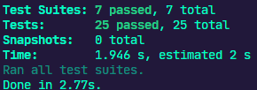

# Desafio 4 do Ignite Trilha NodeJS


<h3 align="center">
  Desafio 04: Introdução ao SOLID
</h3>

<p align="center">
  
  <a href="https://app.rocketseat.com.br/me/matheus-marins">
    
  </a>
  <a href="https://github.com/rocketseat-education/
  ignite-template-introducao-ao-SOLID/stargazers">
      
    </a>
  </p>

---

# :rocket: Sobre o desafio

Nesse desafio, Foi criada uma aplicação para treinar o que aprendi até agora no Node.js!

Essa desafio é uma aplicação de listagem e cadastro de usuários. Para que a listagem de usuários funcione, o usuário que solicita a listagem deve ser um admin (mais detalhes ao longo da descrição).

 ### **Para saber tudo sobre o desafio acesse [NotionDesafio](https://www.notion.so/Desafio-01-Introdu-o-ao-SOLID-3b9be286fac0482ca3b275473ddd2d72).**
 
---
### :keyboard: Instalação e Execução do Projeto

- Clone este repositório

```
> git clone https://github.com/Mar0la/ignite-introduçao-ao-SOLID
```

- Navegue até o diretório principal do projeto

```
> cd ignite-introduçao-ao-SOLID
```

- Instale as dependências com o Yarn

```
yarn
```

- Rode a suite de testes

```
yarn test
```

- Execute o projeto

```
yarn dev
```
---
### **Resolução do Desafio**
  [Como seriam muitos prints para postar, acredito que o README iria ficar grande sem necessidade, peço que cliquem nessa frase é naveguem pelos arquivos.](https://github.com/Mar0la/ignite-introducao-ao-SOLID/tree/main/src)


### **Retorno que devemos ter ao digitar  <code>yarn test</code>** no terminal
  

---
## FeedBack do Desafio
  - Bom, primeiramente gostaria de falar que do mesmo jeito que gostei da organização usando o **SOLID**, tbm achei um pouco complicado, pos estava acostumado com projetos com poucos arquivos com **God Class**.
  - Acho que um **SOLID** bem usado deixa o projeto mais seguro, com uma fácil leitura/compreensão é tbm acredito que deixe uma possibilidade de uma refatoração mais simples.

  - Obs: **God Class**: Na programação orientada a objetos, é uma classe que sabe demais ou faz demais.
---


